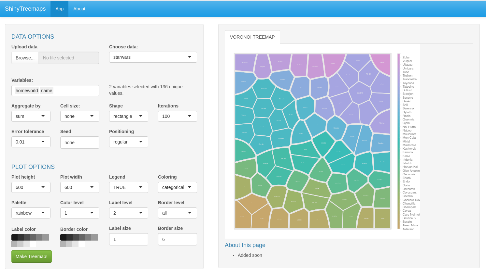

# ShinyTreemaps

R Shiny web app to create Voronoi or sunburst treemaps.
**Available on [Shinyapps.io](https://m-jahn.shinyapps.io/ShinyTreemaps/)!**

### Getting started

Simply run the app at [https://m-jahn.shinyapps.io/ShinyTreemaps/](https://m-jahn.shinyapps.io/ShinyTreemaps/)!

If you want to *run ShinyTreemaps locally*, you need to have R (optionally also Rstudio) and some of its libraries installed, mainly:

- `shiny`
- `shinyjs`
- `shinythemes`
- `shinyWidgets`
- `dplyr`
- `colorspace`
- `WeightedTreemaps`

Open `server.R` or `ui.R` in RStudio and push the `Run App` button in Rstudio, done!
You can also run the app from R console, just call `runApp("path-to-ShinyTreemaps)`.

### An app for R package `WeightedTreemaps`

ShinyTreemaps is simply a GUI wrapper for [WeightedTreemaps](https://github.com/m-jahn/WeightedTreemaps). Treemaps are a visually appealing graphical representation of numerical data using a space-filling approach. A plane or ‘map’ is subdivided into smaller areas called cells. The cells in the map are scaled according to an underlying metric which allows to grasp the hierarchical organization and relative importance of many objects at once. This package contains two different implementations of treemaps, **Voronoi treemaps** and **Sunburst treemaps**.

Features:

- Upload you own data tables (`*.csv` preferred, support for more formats planned)
- Select columns (variables) you want to plot on the map. Selection should follow a hierarchical order from broad to more fine-grained
- Hit the "Make treemap!" button and start customizing your map
- The creation of the map and the styling can be customized by many different parameters

### Structure

ShinyTreemaps consists of a set of R scripts that determine the functionality.

- `server.R` contains the main body of functions. The server obtains input parameters from the GUI and adjusts the graphical output accordingly (changes charts on the fly)
- `ui.R` The GUI contains the interactive modules such as sliders and check boxes.
- `global.R` only imports the external R libraries
- `helpbox.R` contains info boxes for help, contact, and background information

### Input data

- Table (e.g. `*.csv`) in plain text format, with named columns in the first row (`header`)
